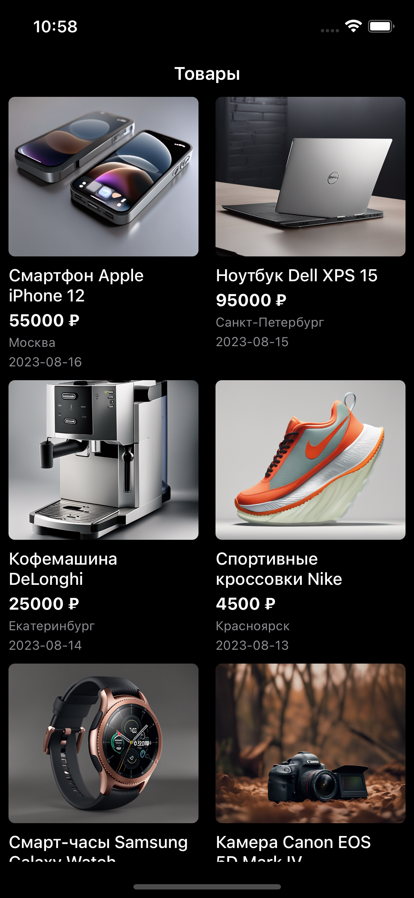
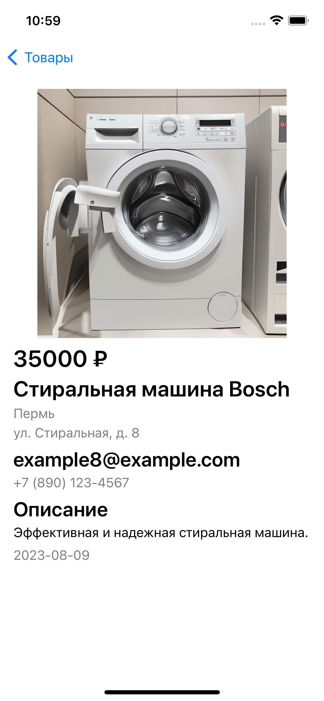
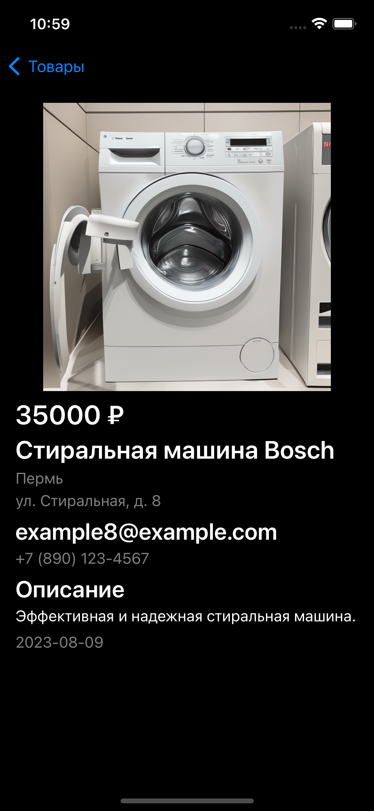

# Тестовое задание Avito Trainee

Данное iOS-приложение - тестовое задание на позицию Trainee в компании Avito.

## Описание

Приложение состоит из двух экранов:
- Список товаров, который служит стартовым экраном.
- Подробная информация о товаре, открываемая при выборе элемента из списка товаров.

## Экран списка товаров

На этом экране пользователь может просмотреть список доступных товаров.
Экран имеет три состояния:
- Отображение ошибки: Если не удается загрузить данные по какой-либо причине, пользователь увидит сообщение об ошибке и сможет попробовать повторно загрузить данные.
- Состояние загрузки: Во время загрузки данных будет показан индикатор загрузки, чтобы пользователь знал, что приложение активно обрабатывает запрос.
- Отображение контента: После успешной загрузки данных пользователь увидит список товаров, представленных в виде сетки с двумя столбцами.

## Экран детальной карточки товара

При нажатии на товар из списка откроется экран с подробной информацией о товаре.
Экран также имеет три состояния: 
- Состояние ошибки
- Состояние загрузки
- Отображение контента

## Скриншоты
### Экран списка товаров

Light Theme            |  Dark Theme
:-------------------------:|:-------------------------:
  |  

### Экран детальной карточки товара

Light Theme            |  Dark Theme
:-------------------------:|:-------------------------:
  |  

### Состояние экранов

Экран ошибка            |  Экран загрузки
:-------------------------:|:-------------------------:
  |  

## Установка и запуск

1. Склонируйте репозиторий с GitHub: https://github.com/soundbanana/TestTask.git
2. Откройте проект в Xcode.
3. Запустите симулятор или подключите устройство и выберите его в качестве целевого устройства.
4. Нажмите кнопку "Run" в Xcode для сборки и запуска приложения.

---
